# Documentation of FastApi Medusa

## Table of Contents
1. [Description](#description)
2. [Normal Endpoints](#normal-endpoints)
   - [1. `/generate-token`](#1-generate-token)
   - [2. `/get_paths`](#2-get_paths)
   - [3. `/import`](#3-import)
   - [4. `/export`](#4-export)
   - [5. `/copy`](#5-copy)
   - [6. `/move`](#6-move)
   - [7. `/from_old_to_new`](#7-from_old_to_new)
   - [8. `/delete`](#8-delete)
3. [Dynamic endpoints with environments variables](#dynamic-endpoints-with-environment-variables)
   - [1. `/env`](#env)
   - [2. `Endpoints`](#endpoints)

### Description
This contribution aims to extend the functionality of Medusa by implementing a microservice using FastAPI.

The goal is to:
- Make Medusa interactive and user-friendly.
- Provide an API interface with Swagger documentation.
- Reduce reliance on terminal commands.

This endpoint generates a Vault token by authenticating with the provided AppRole credentials. It accepts the `role_id` and `secret_id` to authenticate with Vault, and then returns an access token.

# Normal endpoints
## 1. `/generate-token`
This endpoint is responsible for generating a Vault token using AppRole authentication credentials. It requires the role_id and secret_id as inputs and communicates with Vault's authentication system to obtain a client token.

### Goal 
This token can then be used to execute various functionalities of Medusa.

### HTTP Method
`POST`

### URL
`/generate-token`

### Parameters

### Request Body (`AuthRequest`)

| Parameter Name   | Type   | Description                                                  |
|------------------|--------|--------------------------------------------------------------|
| `role_id`        | `str`  | Role ID used for authentication with Vault                    |
| `secret_id`      | `str`  | Secret associated with the role for Vault authentication      |

### Query Parameters

| Parameter Name   | Type   | Description                                        |
|------------------|--------|--------------------------------------------------|
| `vault_url`      | `str`  | Vault URL for authentication (e.g., `http://vault.example.com`) |

### Example Request
### Terminal
```bash
curl -X 'POST' \
  'http://localhost:8000/generate-token?vault_url=http%3A%2F%2Fvault%3A8201' \
  -H 'accept: application/json' \
  -H 'Content-Type: application/json' \
  -d '{
  "role_id": "184376ff-23ba-5c76-0f9a-23cb85777e98",
  "secret_id": "0b4d0ebf-e504-40d5-9f48-14df22983c50"
}'

{
  "role_id": "my-role-id",
  "secret_id": "my-secret-id"
}
```
### Swagger
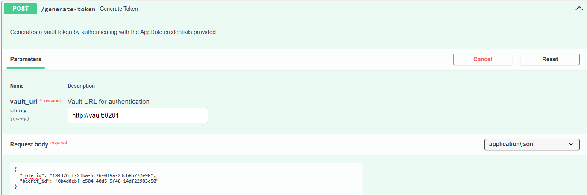
#### Result :
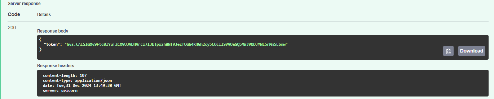

## 2. `/get_paths`

### Description
This endpoint retrieves secret paths from Vault based on the provided Vault URL, authentication token, and root secret. It interacts with the Vault server to fetch the secret paths, processes them, and returns the available paths to the user. If an error occurs during the process, a 500 HTTP error is returned with a detailed message.

### Goal 
The goal of this endpoint is to provide the user with all available secret paths. The user can then easily copy and paste these paths for other methods to retrieve, import, copy, move, or delete secrets, instead of manually writing them.

### HTTP Method
`GET`

### URL
`/get_paths`

### Query Parameters

| Parameter Name   | Type   | Description                                          |
|------------------|--------|------------------------------------------------------|
| `address`        | `str`  | The URL of the Vault server where secrets are stored (e.g., `http://vault.example.com`). |
| `token`          | `str`  | The authentication token required to access Vault (e.g., `s.abc123xyz`). |
| `secret_root`    | `str`  | The root path for fetching secrets (e.g., `secret/`). |

### Example Request

### Swagger
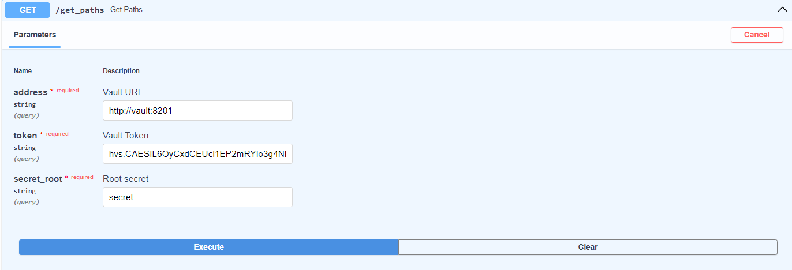
#### Result :
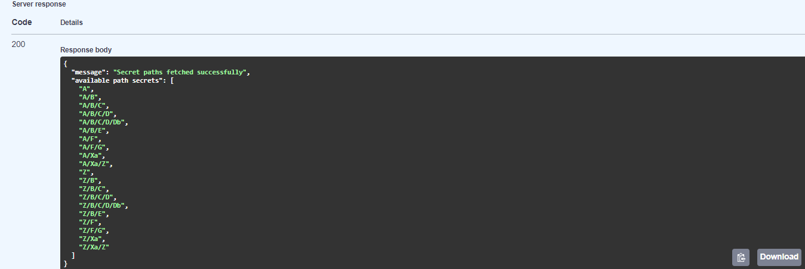

### Error Handling 
If an error occurs, the server will respond with a 500 Internal Server Error and a message detailing the error.

For example:
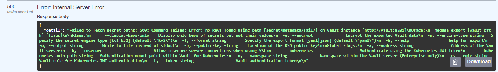


## 3. `/import`

### Description
This endpoint imports files to a specified Vault path using Medusa. The method accepts multiple files, and the files are temporarily saved to the local system before being uploaded to Vault. If no files are provided, a 400 error is returned. Once the files are successfully uploaded, a message is returned with the list of imported file paths.

### Goal
The goal of this endpoint is to allow users to import one or multiple files to a specific path in Vault, specifying the Vault URL, token, and engine type( vault version ). This makes it easier to upload secrets, configurations, or any file-based data to Vault without manual intervention.

### HTTP Method
`POST`

## URL
`/import`

### Query Parameters

| Parameter Name    | Type                  | Description                                        |
|-------------------|-----------------------|----------------------------------------------------|
| `address`         | `str`                 | The URL of the Vault server where secrets are stored (e.g., `http://vault.example.com`). |
| `token`           | `str`                 | The authentication token required to access Vault (e.g., `s.abc123xyz`). |
| `path`            | `str`                 | The secret path where the files will be imported in Vault (e.g., `secret/my-secrets`). |
| `engine_type`     | `str`                 | Specify the Vault engine type (`kv1` or `kv2`). Defaults to `kv2`. |
| `files`           | `List[UploadFile]`    | A list of files to be uploaded. |

### Example Request
### Terminal
```bash
curl -X 'POST' \
  'http://localhost:8000/import?address=http%3A%2F%2Fvault%3A8201&token=00000000-0000-0000-0000-000000000000&path=secret&engine_type=kv2' \
  -H 'accept: application/json' \
  -H 'Content-Type: multipart/form-data' \
  -F 'files=@import-example-1.json;type=application/json'
```
### Swagger
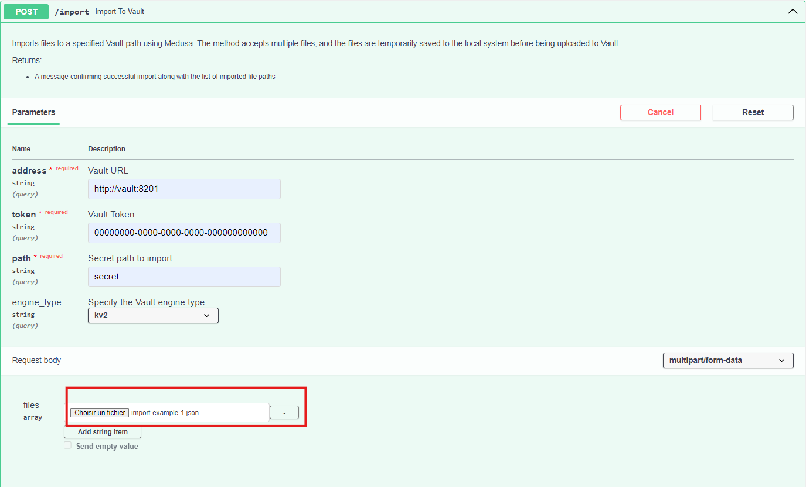
#### Result :
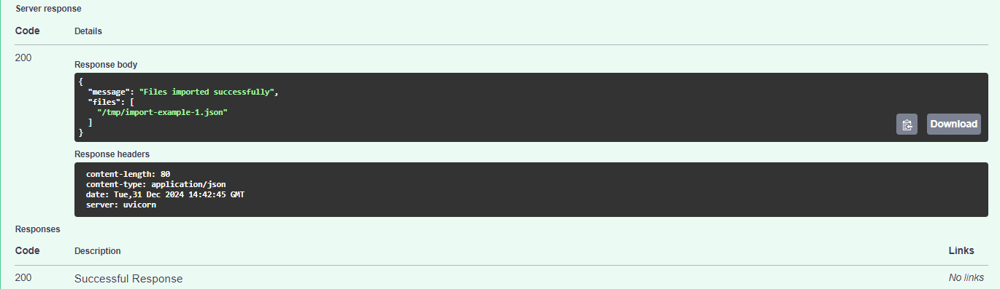

### Error Handling 
If an error occurs, the server will respond with a 500 Internal Server Error and a message detailing the error.

## 4. `/export`

This endpoint is responsible for exporting secrets from a Vault instance to a file. It allows users to specify the file format (YAML or JSON), Vault engine type (kv1 or kv2), and optionally provide a custom file name for the exported file. If no file name is provided, a default name is generated based on the secret path.

### Goal  
This functionality is useful for exporting secrets from Vault for further use or backup in a structured file format. As a  result a downloadable file will be returned in the format specified (either YAML or JSON).

### HTTP Method  
`POST`

### URL  
`/export`

### Parameters

### Query Parameters

| Parameter Name   | Type    | Description                                                   |
|------------------|---------|---------------------------------------------------------------|
| `address`        | `str`   | Vault URL for accessing the instance (e.g., `http://vault.example.com`) |
| `token`          | `str`   | Vault Token for authentication with Vault                     |
| `path`           | `str`   | Secret path to export from Vault                              |
| `file_name`      | `str`   | (Optional) Custom file name for the exported file. If not provided, a default name is used based on the secret path. |
| `output_format`  | `str`   | (Optional) The format for the exported file. Can be `yaml` or `json`. Default is `yaml`. |
| `engine_type`    | `str`   | (Optional) Vault engine type, either `kv1` or `kv2`. Default is `kv2`. |

### Example Request

### Terminal
```bash
curl -X 'POST' \
  'http://localhost:8000/export?address=http%3A%2F%2Fvault%3A8201&token=00000000-0000-0000-0000-000000000000&path=secret%2FA&file_name=name_test&output_format=yaml&engine_type=kv2' \
  -H 'accept: application/json' \
  -d ''n' \
  -H 'Content-Type: application/json'
```
### Swagger
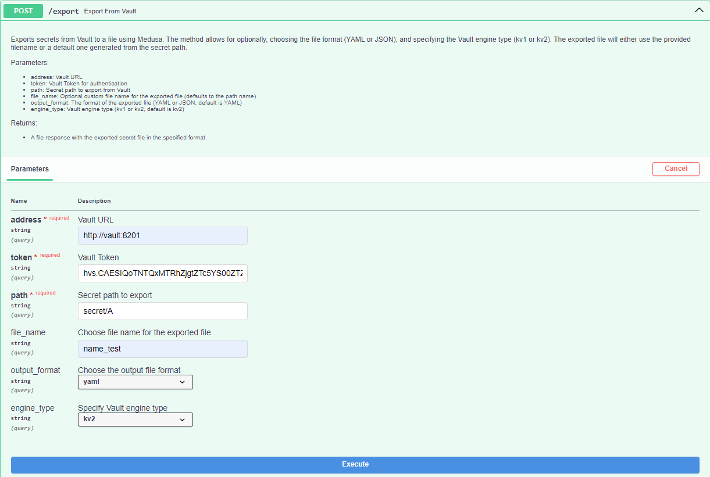
#### Result :
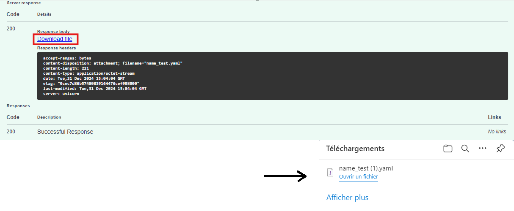

### Error Handling 
If an error occurs, the server will respond with a 500 Internal Server Error and a message detailing the error.

## 5. `/copy`

This endpoint allows copying secrets from one Vault path (`source_path`) to another (`target_path`). The method communicates with Vault using the provided Vault URL and token. It uses the Medusa tool to perform the copy operation. The engine type (kv1 or kv2) for Vault can also be specified. Upon successful execution, a confirmation message with source and target paths is returned.

### Goal  
This functionality allows users to copy secrets from one path to another within the same Vault instance, making it easier to manage and migrate secrets.

### HTTP Method  
`POST`

### URL  
`/copy`

### Parameters

### Query Parameters

| Parameter Name   | Type    | Description                                                   |
|------------------|---------|---------------------------------------------------------------|
| `address`        | `str`   | Vault URL for accessing the instance (e.g., `http://vault.example.com`) |
| `token`          | `str`   | Vault Token for authentication with Vault                     |
| `source_path`    | `str`   | The source secret path in Vault to be copied                   |
| `target_path`    | `str`   | The target secret path in Vault where the secret will be copied |
| `engine_type`    | `str`   | (Optional) Vault engine type, either `kv1` or `kv2`. Default is `kv2`. |

### Example Request

### Terminal
```bash
curl -X 'POST' \
  'http://localhost:8000/copy?address=http%3A%2F%2Fvault%3A8201&token=00000000-0000-0000-0000-000000000000&source_path=secret%2FA&target_path=B%2FA&engine_type=kv2' \
  -H 'accept: application/json' \
  -d ''
```
### Swagger
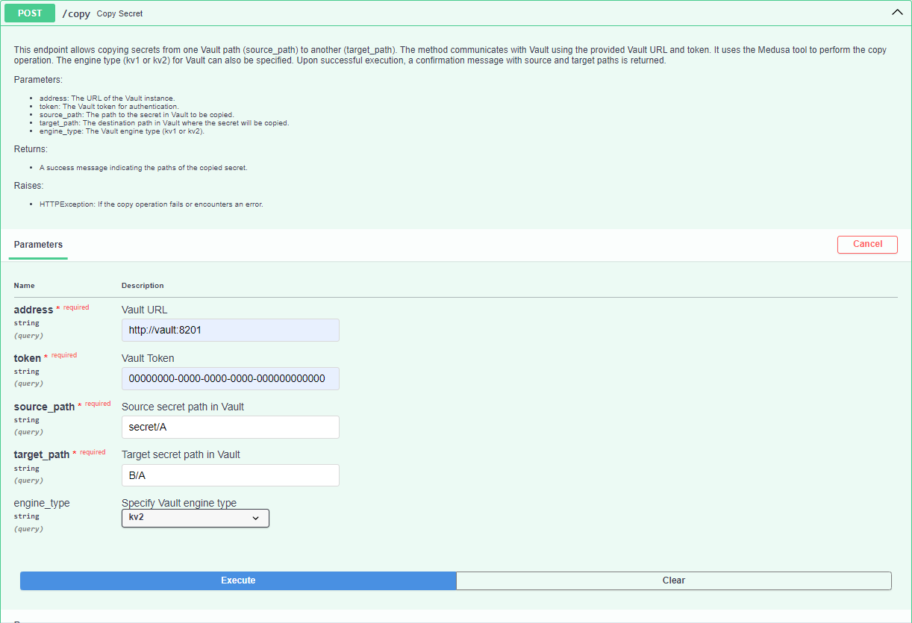
#### Result :
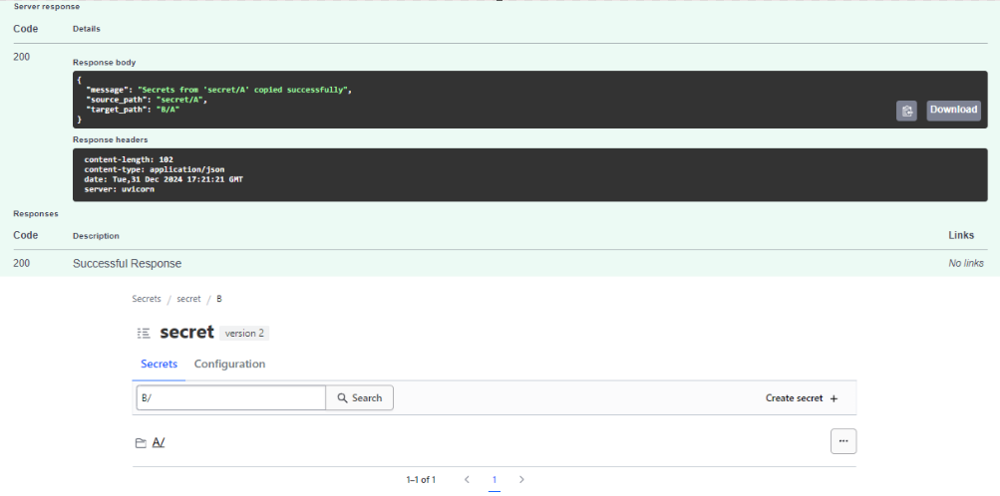

## 6. `/move`

This endpoint allows moving secrets from one Vault path (`source_path`) to another (`target_path`). The method communicates with Vault using the provided Vault URL and token. It uses the Medusa tool to perform the move operation. After the secret is successfully moved to the target path, it is deleted from the source path. The engine type (kv1 or kv2) for Vault can also be specified. Upon successful execution, a confirmation message with source and target paths is returned.

### Goal  
This functionality allows users to move secrets from one path to another within the same Vault instance, enabling easier secret management and cleanup.

### HTTP Method  
`POST`

### URL  
`/move`

### Parameters

### Query Parameters

| Parameter Name   | Type    | Description                                                   |
|------------------|---------|---------------------------------------------------------------|
| `address`        | `str`   | Vault URL for accessing the instance (e.g., `http://vault.example.com`) |
| `token`          | `str`   | Vault Token for authentication with Vault                     |
| `source_path`    | `str`   | The source secret path in Vault to be moved                   |
| `target_path`    | `str`   | The target secret path in Vault where the secret will be moved |
| `engine_type`    | `str`   | (Optional) Vault engine type, either `kv1` or `kv2`. Default is `kv2`. |

### Example Request

### Terminal
```bash
curl -X 'POST' \
  'http://localhost:8000/move?address=http%3A%2F%2Fvault%3A8201&token=00000000-0000-0000-0000-000000000000&source_path=secret%2FA&target_path=Z%2FA&engine_type=kv2' \
  -H 'accept: application/json' \
  -d ''
```
### Swagger
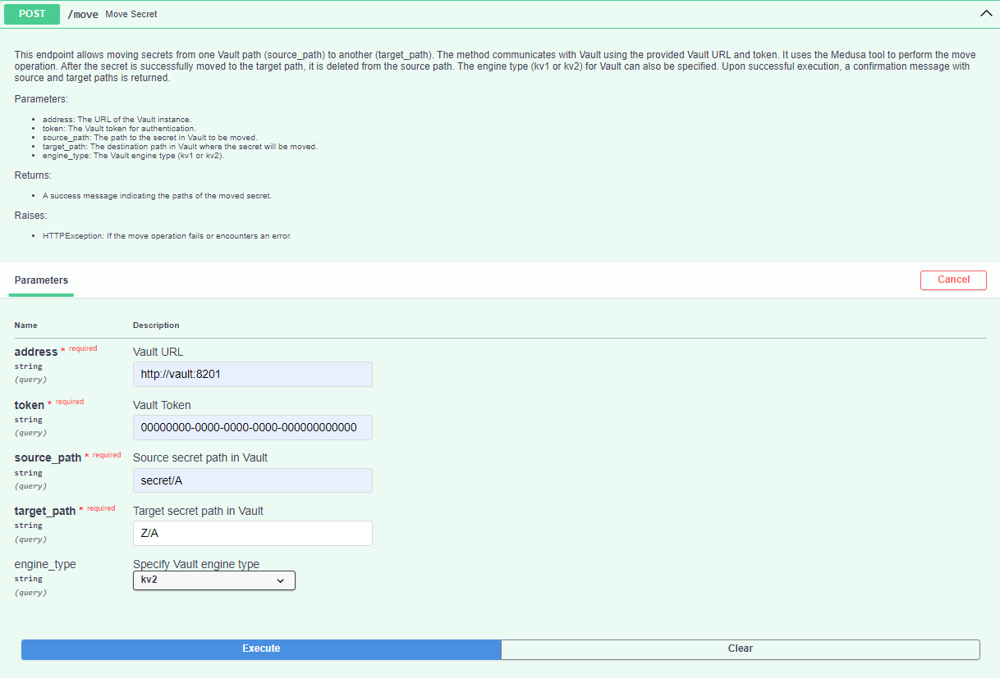
#### Result :
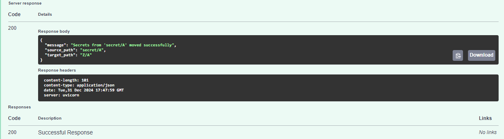
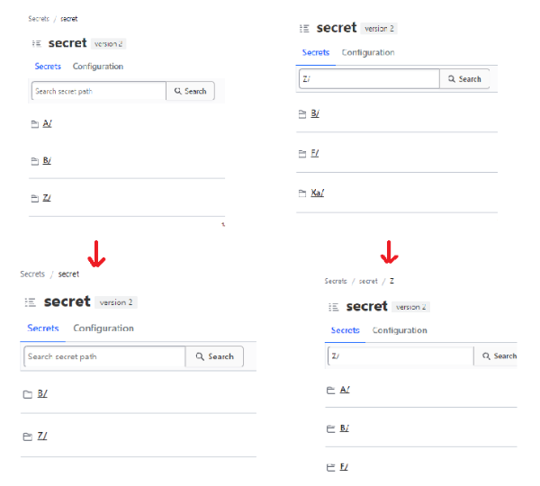


## 7. `/from_old_to_new`

### Description
This endpoint facilitates the migration of secrets from an old Vault instance to a new Vault instance. It uses the Medusa tool to export secrets from the old Vault and imports them into the new Vault. The migration ensures secure transfer of secrets.

### Goal
The purpose of this endpoint is to automate the migration of secrets between Vault instances, reducing manual effort and minimizing errors. Users can seamlessly move secrets from an outdated or deprecated Vault instance to a new one.

### HTTP Method
`POST`

### URL
`/from_old_to_new`

### Query Parameters

| Parameter Name       | Type   | Description                                                                                     |
|----------------------|--------|-------------------------------------------------------------------------------------------------|
| `old_address`        | `str`  | The URL of the old Vault instance (e.g., `http://old-vault.example.com`).                       |
| `old_token`          | `str`  | The authentication token for the old Vault instance.                                           |
| `old_path`           | `str`  | The secret path in the old Vault instance to be migrated (e.g., `secret/my-old-secrets`).       |
| `old_engine_type`    | `str`  | The engine type of the old Vault (`kv1` or `kv2`). Defaults to `kv2`.                          |
| `new_address`        | `str`  | The URL of the new Vault instance (e.g., `http://new-vault.example.com`).                       |
| `new_token`          | `str`  | The authentication token for the new Vault instance.                                           |
| `new_path`           | `str`  | The secret path in the new Vault instance where secrets will be stored (e.g., `secret/my-new-secrets`). |
| `engine_type`        | `str`  | The engine type of the new Vault (`kv1` or `kv2`). Defaults to `kv2`.                          |


### Example Request

```bash
curl -X 'POST' \
  'http://localhost:8000/from_old_to_new?old_address=http%3A%2F%2Fvault%3A8201&old_token=00000000-0000-0000-0000-000000000000&old_path=secret&old_engine_type=kv2&new_address=http%3A%2F%2Fvault3%3A8203&new_token=00000000-0000-0000-0000-000000000000&new_path=secret%2Ftest_moving&engine_type=kv2&decrypt=false' \
  -H 'accept: application/json' \
  -d ''
```
### Swagger
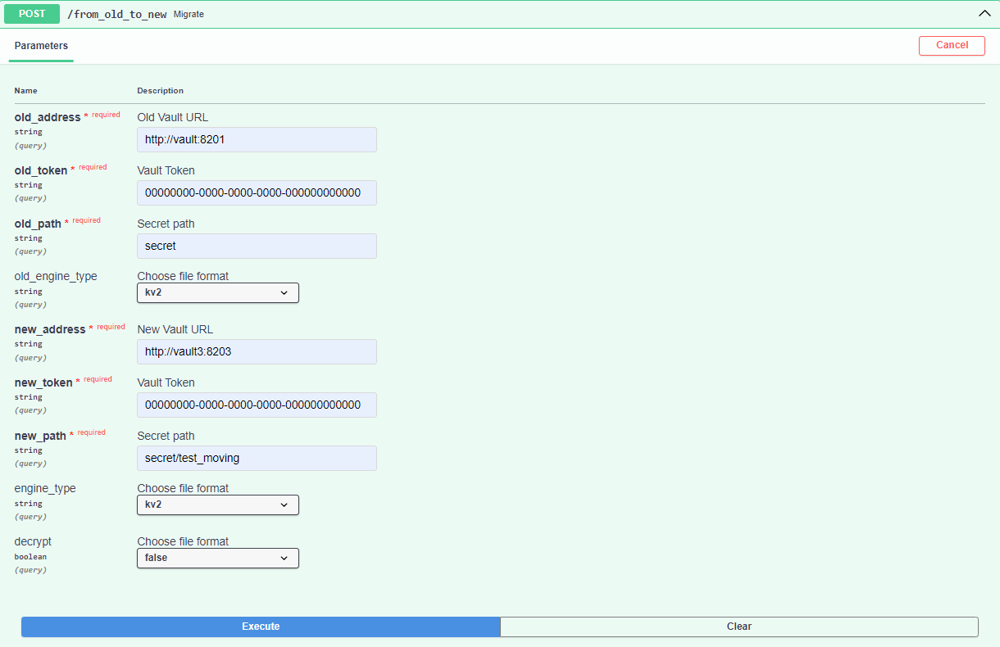
#### Result :
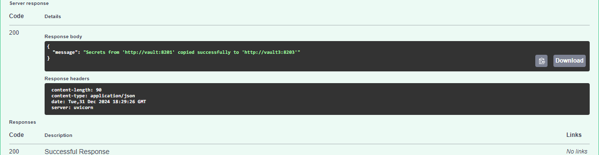

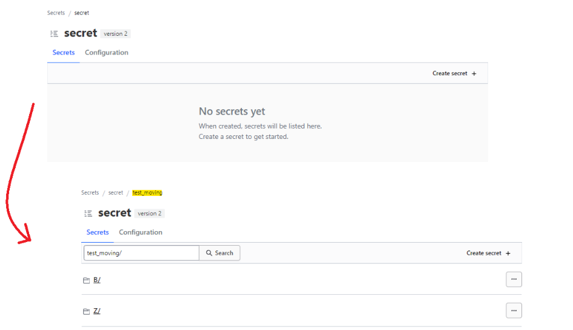

## 8. `/delete`

This endpoint deletes a secret from a HashiCorp Vault instance. It uses the Medusa CLI tool to perform the deletion of the specified secret at the given path in the Vault. The operation is automatically approved and executed with the provided Vault address and authentication token.

### Goal  
This functionality is designed to remove secrets from a Vault instance, ensuring sensitive data can be securely deleted when it is no longer needed.

### HTTP Method  
`DELETE`

### URL  
`/delete`

### Parameters

### Query Parameters

| Parameter Name   | Type    | Description                                                  |
|------------------|---------|--------------------------------------------------------------|
| `address`        | `str`   | Vault URL for accessing the instance (e.g., `http://vault.example.com`) |
| `token`          | `str`   | Vault Token for authentication with Vault                     |
| `secret_path`    | `str`   | The path of the secret in Vault to be deleted                 |

### Example Request

### Terminal
```bash
curl -X 'DELETE' \
  'http://localhost:8000/delete?address=http%3A%2F%2Fvault%3A8201&token=00000000-0000-0000-0000-000000000000&secret_path=secret%2FB' \
  -H 'accept: application/json'
```
### Swagger
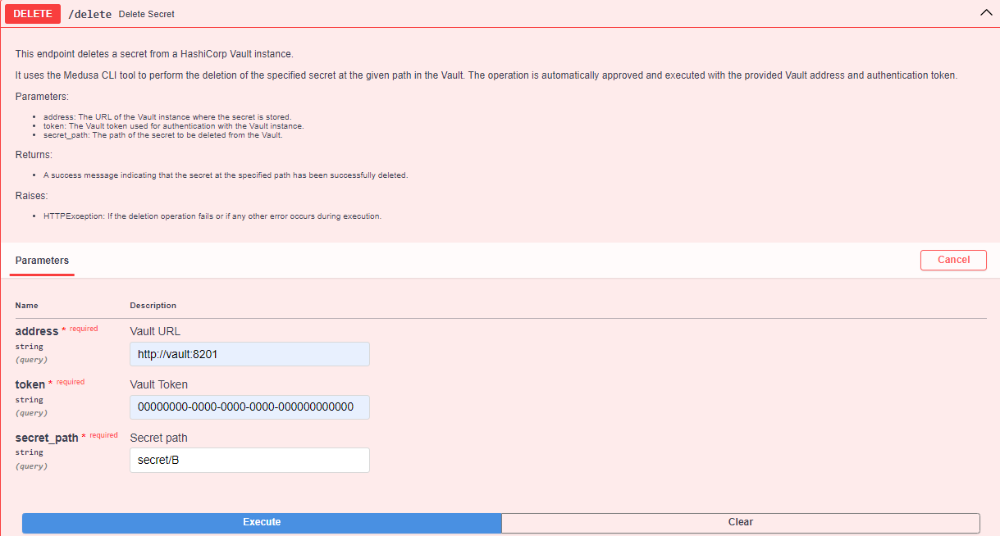
#### Result :
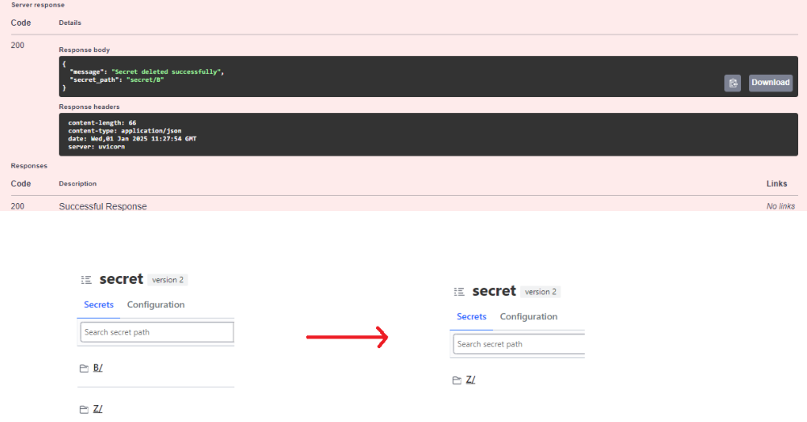

# Dynamic Endpoints with Environment Variables

To make endpoints more dynamic and avoid repeatedly entering the URL, token, and engine type, you can now create these as environment variables using the `/env` endpoint. 

## `/env`
The `/env` endpoint takes the following parameters:
- **Vault URL**: The address of your Vault instance.
- **Token**: Your authentication token.
- **Engine Type**: The type of engine you are working with.

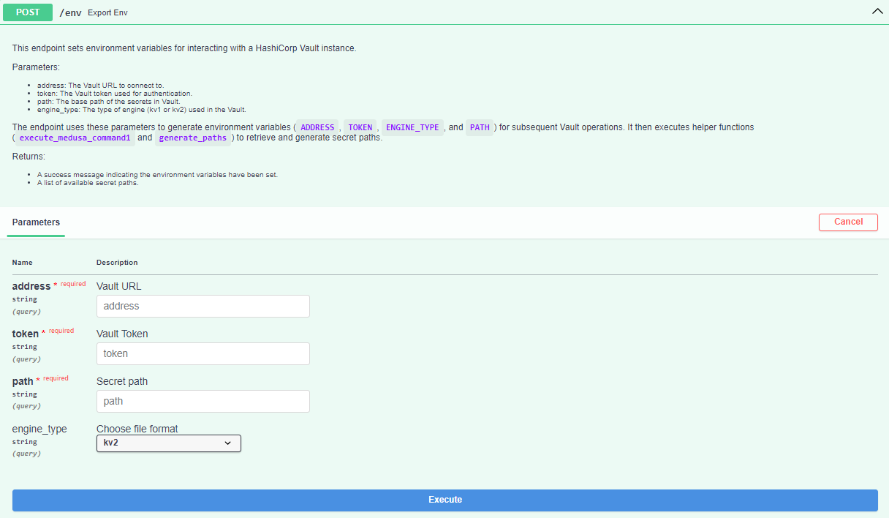

### Result
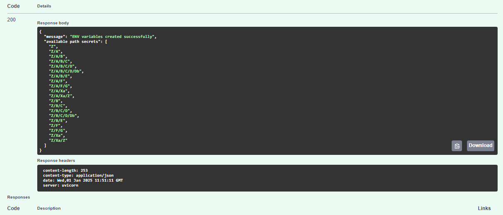
## Endpoints
Once the `/env` endpoint is executed, you can seamlessly use the advanced endpoints for all Medusa operations, such as:
- **Export**
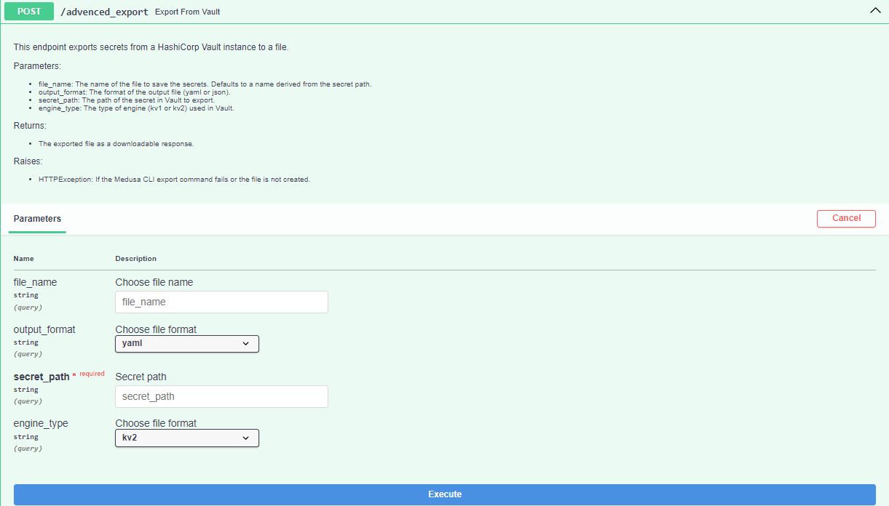
- **Import**
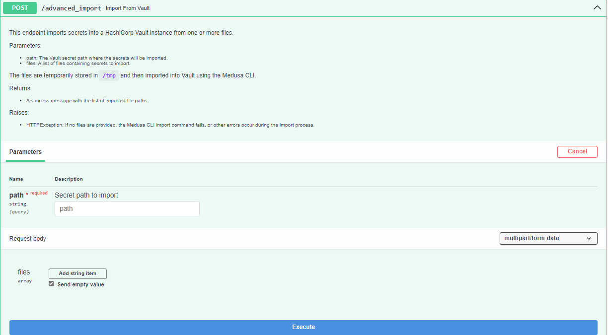
- **Copy**
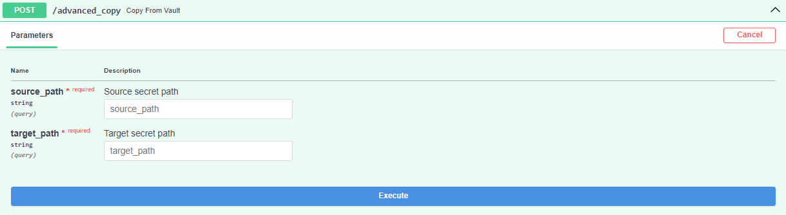
- **Move**
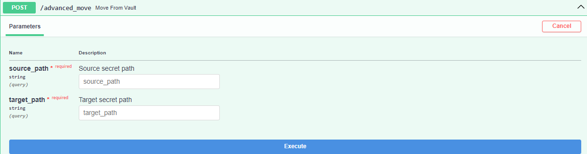
- **Delete**
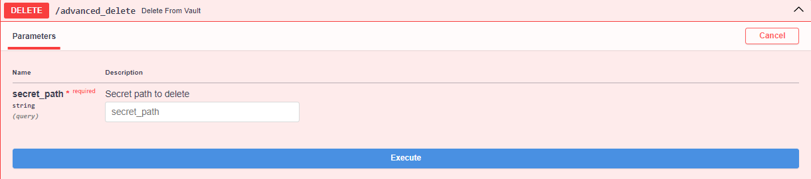
These advanced endpoints are built on top of the standard ones but are more dynamic, removing the need to repeatedly input parameters manually.
